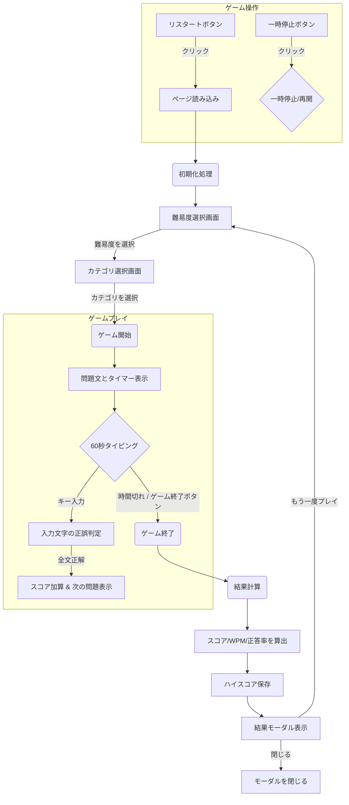

# タイピングゲーム


## 概要
このタイピングゲームは、60秒間でどれだけ正確に、そして速く英文をタイピングできるかを競うゲームです。難易度や出題カテゴリを選択する機能やハイスコアランキングも搭載しており、楽しみながらタイピングスキルを向上させることができます。

また、ゲーム中は問題文の日本語訳が常に表示されるため、英文の意味を理解しながら練習することが可能です。

## 遊び方
このゲームは、ブラウザのセキュリティ制約（CORS）のため、ローカルファイルとして直接開くのではなく、ローカルウェブサーバーを介して実行する必要があります。

1.  **ターミナルまたはコマンドプロンプトを開きます。**
2.  **このプロジェクトのディレクトリに移動します。**
    ```bash
    cd path/to/typing-game
    ```
3.  **PythonのHTTPサーバーを起動します。**
    ```bash
    python3 -m http.server 8000
    ```
    （もし`python3`が動作しない場合は、`python -m http.server 8000`を試してください。）
4.  **ブラウザを開き、`http://localhost:8000/`にアクセスします。**

ゲームが開始されたら、まず難易度を選択し、次に出題カテゴリを選択します。その後、画面に英文が表示されるので、テキストボックスに正確に入力してください。60秒間の制限時間内に、より多くの文字を正確にタイプして高スコアを目指しましょう。

## 機能
*   **難易度選択:** 「Easy」「Normal」「Hard」の3段階から難易度を選択できます。
*   **豊富な問題数とカテゴリ選択:** 「ことわざ」「名言」「プログラミング」のカテゴリから選択できます。各カテゴリには難易度別に合計100問、全体で300問の豊富な問題が用意されています。
*   **日本語訳表示:** 問題文のすぐ上に日本語訳が表示され、英文の意味を確認しながらタイピングできます。
*   **英文タイピング:** 選択した難易度とカテゴリに応じてランダムに選ばれた英文をタイピングします。
*   **スコア表示:** 正しく入力した文字数に基づいてスコアが加算されます。
*   **演出付きタイマー:** 60秒の制限時間内にどれだけタイピングできるかを競います。残り時間が少なくなるとタイマーの色が変化し、アニメーションで緊迫感を演出します。
*   **結果表示:** ゲーム終了後、スコア、WPM（Words Per Minute）、正答率がモーダルウィンドウで表示されます。
*   **ハイスコアランキング:** 難易度とカテゴリの組み合わせごとに上位5件のハイスコアが自動で保存され、結果画面で確認できます。（スコアはブラウザのローカルストレージに保存されます）
*   **ゲーム操作:**
    *   **一時停止/再開:** ゲーム中にタイマーと入力を一時停止・再開できます。
    *   **ゲーム終了:** 制限時間内でもゲームを途中で終了できます。
    *   **リスタート:** いつでもゲームを最初からやり直せます。
*   **英文データの外部化:** `quotes.json`ファイルを編集することで、簡単に出題される英文（日本語訳、カテゴリを含む）を追加・変更できます。
*   **問題の重複防止:** 同じ問題が連続して出題されないように制御しています。

## 機能フロー


## 技術スタック
*   HTML
*   CSS
*   JavaScript
