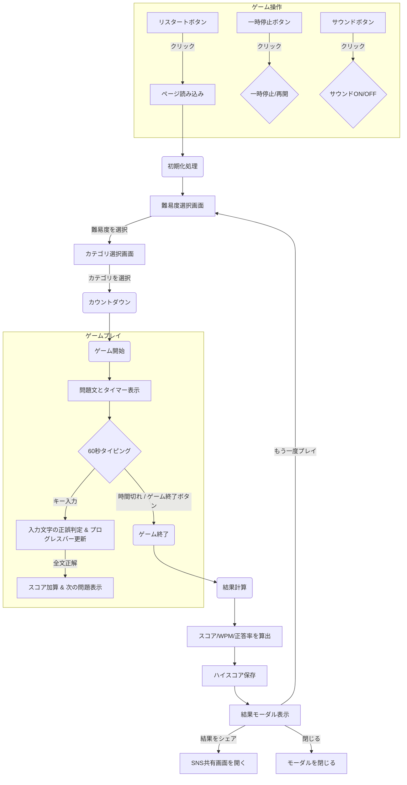

# タイピングゲーム


## 概要
このタイピングゲームは、60秒間でどれだけ正確に、そして速く英文をタイピングできるかを競うゲームです。難易度や出題カテゴリを選択する機能やハイスコアランキングも搭載しており、楽しみながらタイピングスキルを向上させることができます。

また、ゲーム中は問題文の日本語訳が常に表示されるため、英文の意味を理解しながら練習することが可能です。

## 遊び方
このゲームを実行するには、Node.jsとnpmがインストールされている必要があります。

1.  **ターミナルまたはコマンドプロンプトを開きます。**
2.  **このプロジェクトのディレクトリに移動します。**
    ```bash
    cd path/to/typing-game
    ```
3.  **必要なパッケージをインストールします。**
    ```bash
    npm install
    ```
4.  **開発サーバーを起動します。**
    ```bash
    npm run dev
    ```
5.  **ブラウザを開き、ターミナルに表示されたURL（通常は `http://localhost:5173/`）にアクセスします。**

ゲームが開始されたら、まず難易度を選択し、次に出題カテゴリを選択します。その後、画面に英文が表示されるので、テキストボックスに正確に入力してください。60秒間の制限時間内に、より多くの文字を正確にタイプして高スコアを目指しましょう。

## 機能
*   **難易度選択:** 「Easy」「Normal」「Hard」の3段階から難易度を選択できます。
*   **豊富な問題数とカテゴリ選択:** 「ことわざ」「名言」「プログラミング」のカテゴリから選択できます。各カテゴリには難易度別に合計100問、全体で300問の豊富な問題が用意されています。
*   **日本語訳表示:** 問題文のすぐ上に日本語訳が表示され、英文の意味を確認しながらタイピングできます。
*   **ゲーム開始前カウントダウン:** 「3, 2, 1, Go!」のカウントダウンで、集中力を高めてからゲームを開始できます。
*   **プログレスバー:** 問題文の進捗状況が視覚的に表示され、ゴールまでの距離が一目でわかります。
*   **スコア表示:** 正しく入力した文字数に基づいてスコアが加算されます。
*   **演出付きタイマー:** 60秒の制限時間内にどれだけタイピングできるかを競います。残り時間が少なくなるとタイマーの色が変化し、アニメーションで緊迫感を演出します。
*   **結果表示:** ゲーム終了後、スコア、WPM（Words Per Minute）、正答率がモーダルウィンドウで表示されます。
*   **ハイスコアランキング:** 難易度とカテゴリの組み合わせごとに上位5件のハイスコアが自動で保存され、結果画面で確認できます。（スコアはブラウザのローカルストレージに保存されます）
*   **結果のSNS共有:** ゲームの結果をX（旧Twitter）で友人やフォロワーに共有できます。
*   **サウンドエフェクト:** 正解音、エラー音、終了音により、ゲーム体験がより豊かになります。サウンドは画面右上のボタンでいつでもON/OFFを切り替え可能です。
*   **ゲーム操作:**
    *   **一時停止/再開:** ゲーム中にタイマーと入力を一時停止・再開できます。
    *   **ゲーム終了:** 制限時間内でもゲームを途中で終了できます。
    *   **リスタート:** いつでもゲームを最初からやり直せます。
*   **レスポンシブデザイン:** PCだけでなく、スマートフォンやタブレットでも快適にプレイできるよう、画面サイズに応じてレイアウトが最適化されます。
*   **問題の重複防止:** 同じ問題が連続して出題されないように制御しています。

## 機能フロー


## 技術スタック
*   HTML
*   CSS
*   TypeScript
*   Vite

## 変更履歴
### 2025-12-15
*   **開発環境の近代化**
    *   Viteを導入し、モダンな開発環境を構築。
    *   `npm`スクリプト (`dev`, `build`, `preview`) を設定。
*   **ソースコードのモジュール化**
    *   TypeScriptのソースコードを機能ごとに複数のモジュールに分割し、可読性と保守性を向上。
*   **UI/UXの改善**
    *   ゲーム開始前のカウントダウン機能を追加。
    *   問題文の進捗を示すプログレスバーを追加。
    *   結果をX（旧Twitter）で共有する機能を追加。
    *   スマートフォン表示に対応するため、レスポンシブデザインを強化。
*   **新機能の追加**
    *   エラー音、正解音、終了音などのサウンドエフェクトと、そのON/OFF切り替え機能を追加。

## next step

*   **新しいゲームモードの追加:**
    *   **サバイバルモード:** 一度でもミスタイプをするとゲームオーバーとなる、正確性が求められるモード。
    *   **タイムアタックモード:** 決められた問題数（例：5問）を、どれだけ速くクリアできるかを競うモード。
*   **間違えた単語の復習機能:**
    *   ゲーム終了時に、タイプミスが多かった単語や入力に時間がかかった単語を一覧表示する。
    *   苦手な単語だけを集中的に練習できる「復習モード」を追加する。
*   **詳細な統計データと成長の可視化:**
    *   日々のスコアやWPMの推移を折れ線グラフで表示し、上達度を可視化する。
    *   カテゴリごとの平均スコアや正答率を記録し、得意・不得意な分野を分析できるようにする。
